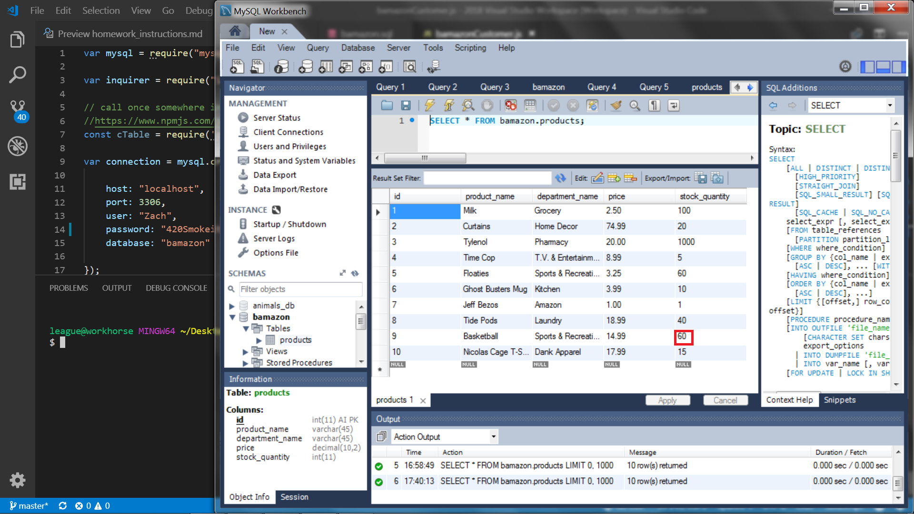
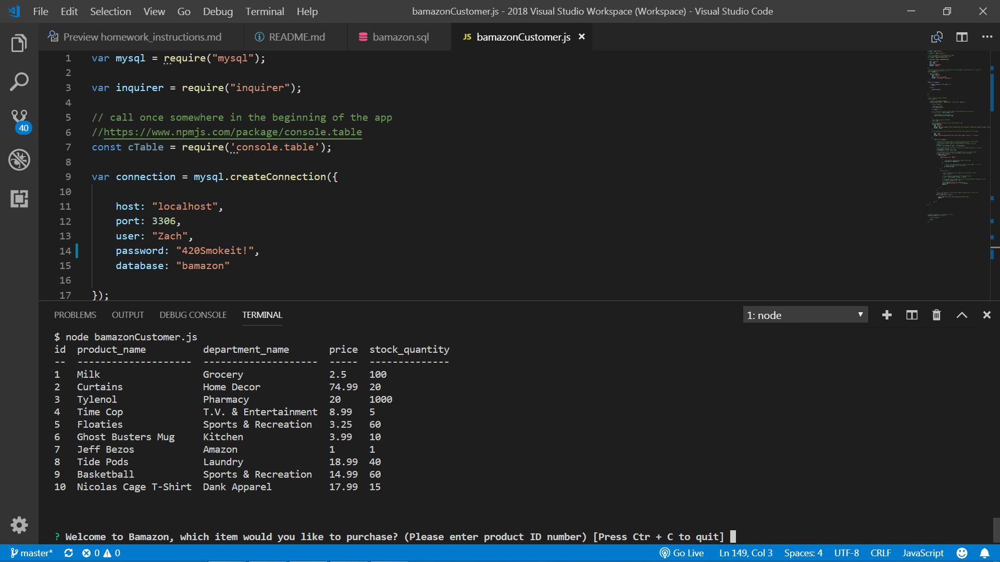
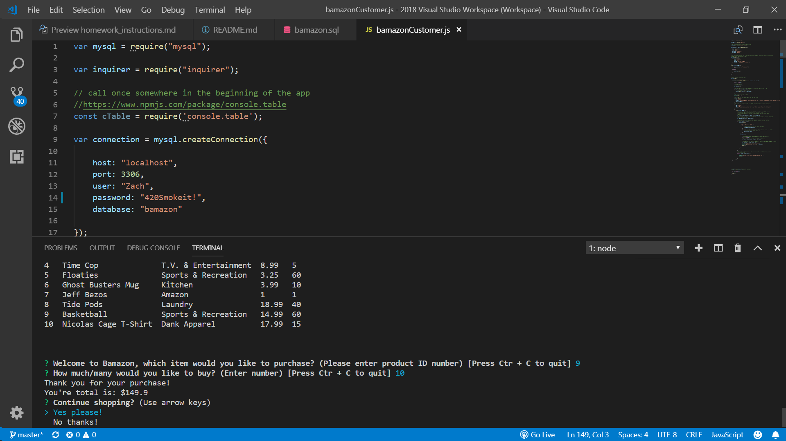
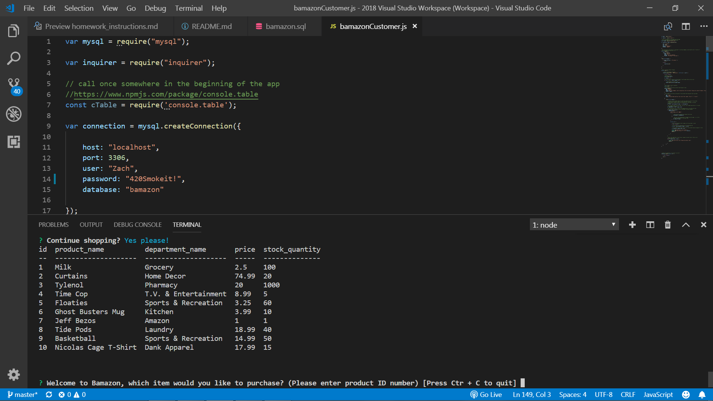
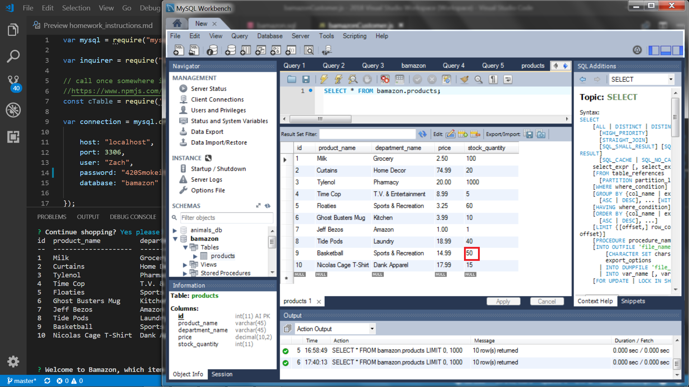

# Bamazon

Bamazon is an app that creates a simple virtual shopping experience.

 

Upon running the app, the user will be prompted to select an shopping item from a table that is linked to a mysql database.

 

The user may select an item by inputting the id number of the product. 

 

After selecting an item, the user will have to choose the quantity of the item they wish to purchase.

 

The app will then provide the user with the total cost of their purchase, update the table accordingly, and ask them if they would like to continue shopping. 

